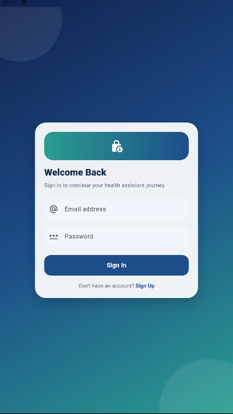
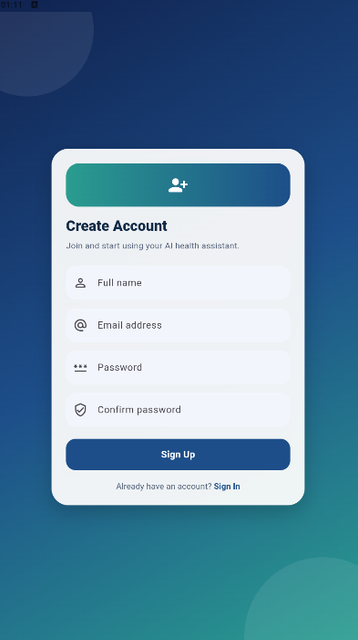
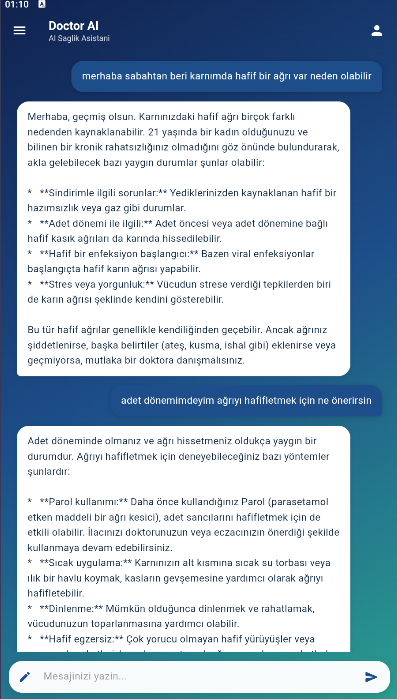
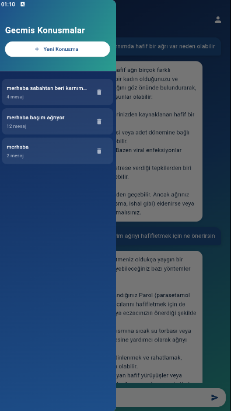
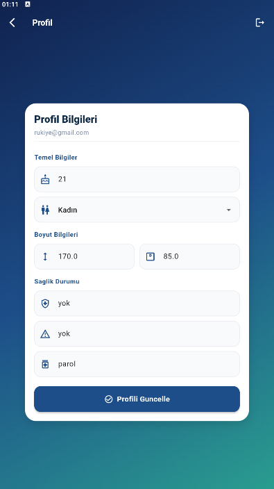
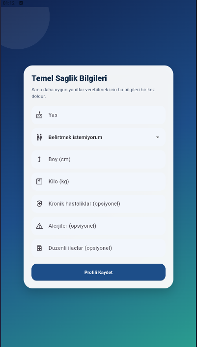

# Doctor AI - Flutter Gemini Chatbot

Doctor AI is a health-focused chatbot application built with Flutter. Users can define their basic health profile and chat with an AI assistant in Turkish. The app uses Firebase Authentication, Firestore for profile and conversation storage, Gemini API for AI responses, and Bloc/Cubit for state management.

## Features

- Secure sign-in and sign-up with Firebase Authentication
- Profile Gate flow on startup (checks whether profile is complete)
- Health profile create/update screens
- Gemini-powered AI chat
- Conversation history save, load, list, and delete
- Conversation continuity using recent chat context
- Rate-limit handling and model fallback strategy

## Screenshots








## Tech Stack

- Flutter
- Firebase Core
- Firebase Authentication
- Cloud Firestore
- flutter_bloc (Cubit)
- Gemini API (HTTP)
- flutter_dotenv

## Architecture

The project is organized in a layered feature structure:

- features/auth: authentication flow
- features/data: external services and data access
- features/domain: entities and repository contracts
- features/presentation: cubits, states, and pages

Authentication routing is bloc-driven and state-based at the app root.

## Setup

1. Clone the repository.
2. Install dependencies:

```bash
flutter pub get
```

3. Create a `.env` file in the project root and add your Gemini API key:

```env
GEMINI_API_KEY=YOUR_API_KEY
```

4. Add Firebase platform files:
- Android: `android/app/google-services.json`
- iOS: `ios/Runner/GoogleService-Info.plist`

5. Run the app:

```bash
flutter run
```

## AI Model Strategy

The app uses model fallback in this order:

- gemini-2.0-flash
- gemini-2.5-flash
- gemini-2.5-flash-lite

If a request times out, hits temporary availability issues, or rate limits, the next model is tried automatically.

## Conversation History and Continuity

- Messages are stored under `users/{userId}/conversations` in Firestore.
- Previous conversations can be reopened from the history drawer.
- Recent messages are included as context for new AI calls.
- Cache keys are user- and context-aware to reduce incorrect cache hits.

## Medical Disclaimer

This app does not provide medical diagnosis. Responses are informational only. In urgent situations or severe symptoms, contact a healthcare professional directly.

## Development Notes

- Use `flutter analyze` for code quality checks.
- State management is implemented with Cubit.
- UI is designed to be modern, clean, and mobile-friendly.

