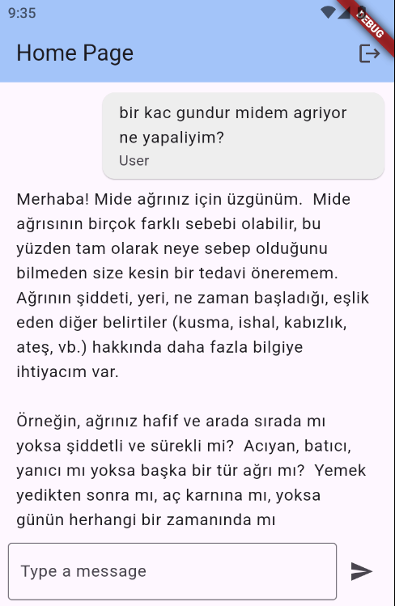

Flutter Gemini AI Chatbot
This app is a doctor chatbot designed to support your health journey. Got a question about your symptoms or feeling unsure about something? Instead of rushing to the clinic, get instant insights and helpful information right from your phone. This intelligent assistant is here to guide you—anytime, anywhere.

🔐 Authentication
This project uses Firebase Authentication to handle user sign-in and sign-up processes securely and efficiently. It supports multiple authentication methods such as:

📧 Email & Password

Firebase Auth ensures a smooth and secure user experience across platforms.

🤖 AI Integration
This app leverages Gemini 1.5 Flash by Google for its AI capabilities.

We integrated the Gemini AI model to provide fast and context-aware responses, especially for our doctor chatbot system. The Gemini 1.5 Flash model was chosen due to its high performance and efficiency in real-time scenarios—making it ideal for mobile environments.

Whether it's understanding user input or generating insightful replies, Gemini AI powers the intelligence behind the chat.

